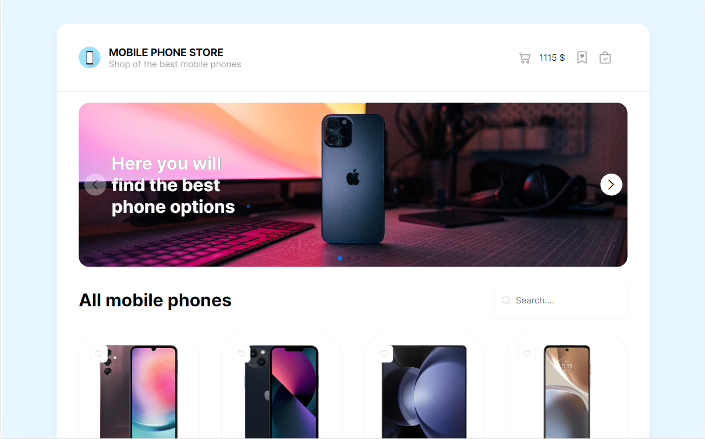
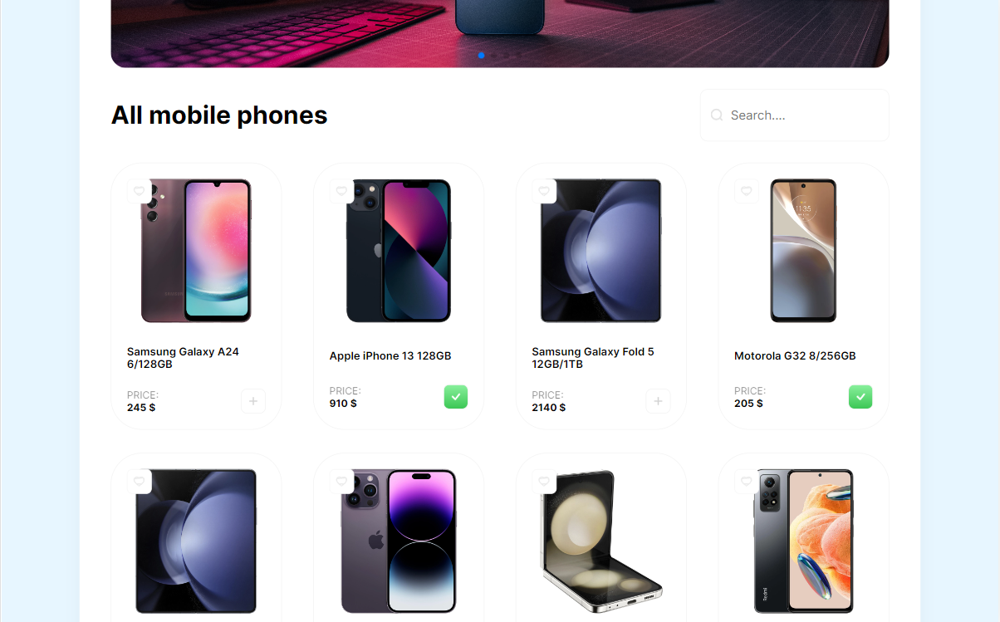
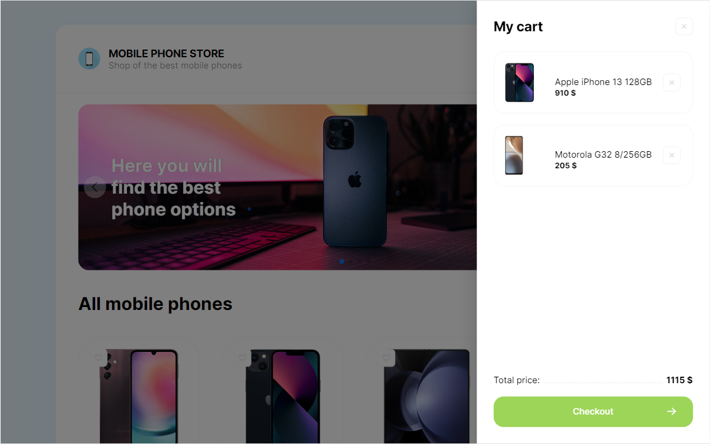
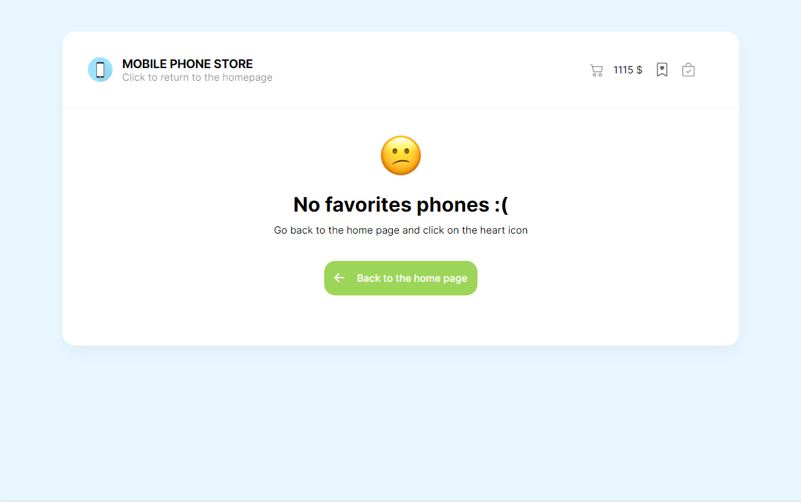
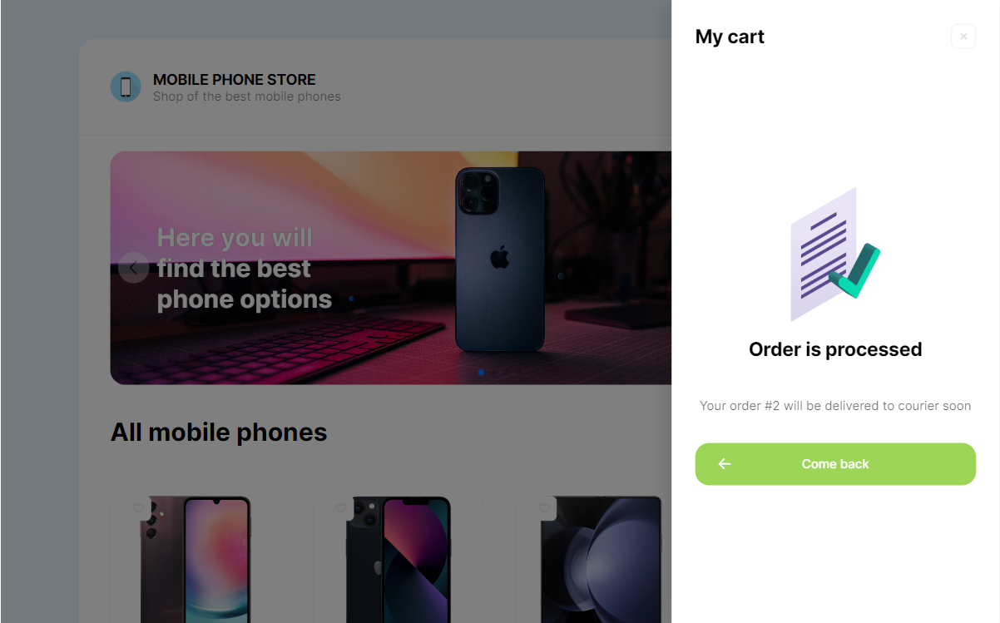
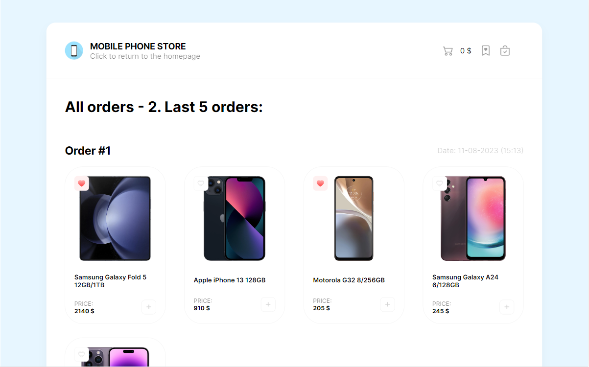
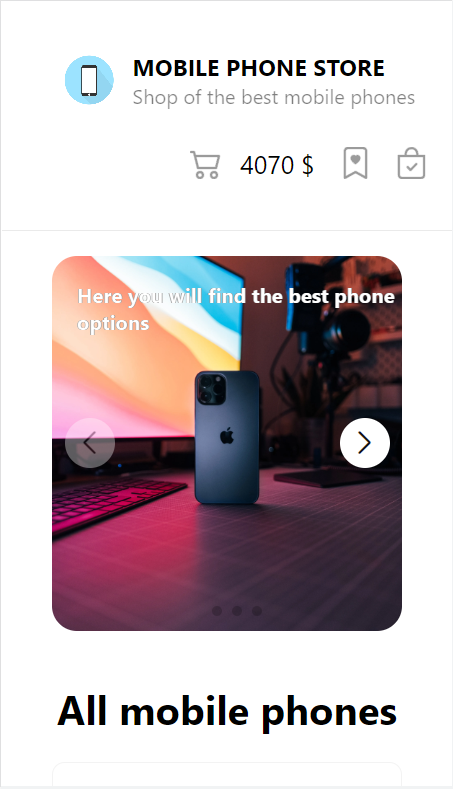
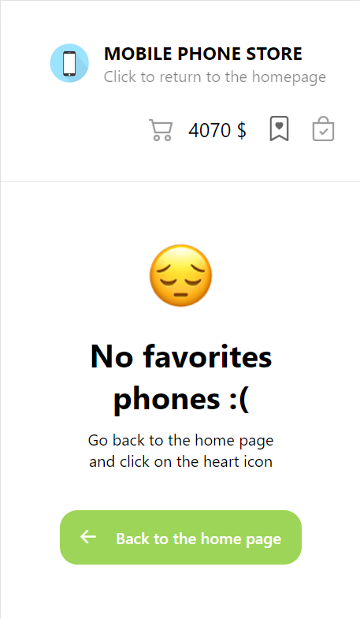

# Mobile phone store on React
In this project I used:
* __HTML__
* __CSS__
* __SCSS__
* __JS__
* __Swiper for slider__
* __ReactJS:__
    * __CSS modules__
    * __React router__
    * __Axios__
    * __React hooks:__
        * useState
        * useEffect
        * useContext
        * useRef
        * custom hook
* __Service MockApi as db__

[Link on this website](https://k-a-webdev.github.io/React-mobilePhone-store/)

## Features
This web-application is responsive. \
Phones can be added not only to the cart, but also to favorites. All data is stored in a remote json file.
Using the buttons in the header, you can open the shopping cart, go to the page of your favorite products and go to the page with already completed purchases.

